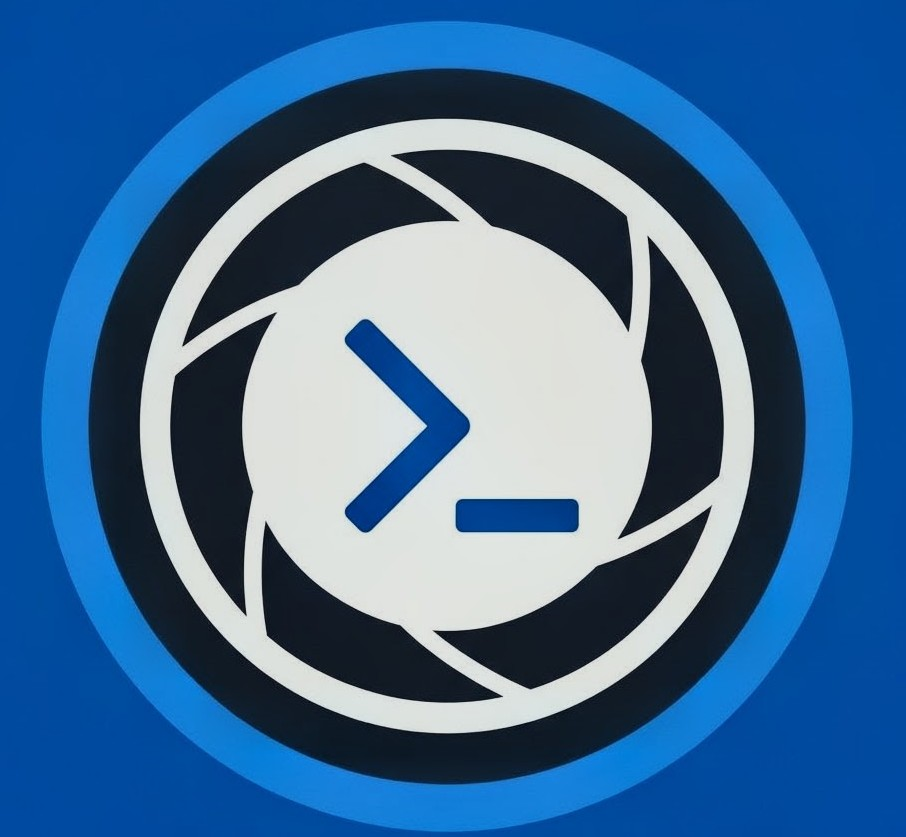

  
  
  # VisionLangToolit

  **Advanced Imag Analysis & Color Extraction Tool**

  
  
  
</d>

## 📌 About The Project
**VisionLangToo* is a professional web-based SaaS application designed to process and analyze images seamlessly. It extracts technical metadata such as resolution, format, aspect ratio, and orientation, alongside a precise dominant color palette with hex codes and recognized color names. 

The platform includes a responsive user interface, secure authentication (GitHub OAuth & Email), and an interactive live mobile preview section.

## ✨ Features
* **Image Metadata Extraction:** Instantly retrieves File Size, Resolution, Format (PNG/JPG/WEBP), Orientation (Landscape/Portrait), and Aspect Ratio.
* **Smart Color Palette:** Identifies the top 5 dominant colors from the uploaded image and fetches their exact names using `TheColorAPI`.
* **Click-to-Copy Hex Codes:** Interactive color swatches that allow users to copy hex codes to their clipboard instantly.
* **Authentication System:** Integrated GitHub OAuth and Email-based dummy registration flows.
* **Live iPhone Preview:** Embedded interactive iPhone mockup frame to test game/project URLs directly within the dashboard.
* **Export Data:** Option to export the analyzed image metadata as a JSON file.

## 🛠️ Tech Stack
**Frontend:**
* HTML5, Vanilla JavaScript
* Tailwind CSS (via CDN)
* Hosted on **Vercel**

**Backend:**
* Python, Flask
* Pillow (PIL) for image processing
* Authlib (for GitHub OAuth integration)
* Hosted on **Railway**

## 🚀 Live Demo
**Frontend Application:** [https://visionlangtoolkit.quarry.dpdns.org/#]
**Backend API (Health Check):** [https://visionlangtoolkit-production.up.railway.app/](https://visionlangtoolkit-production.up.railway.app/)

## 📖 API Documentation
VisionLangToolkit offers a RESTful API endpoint for image analysis.

### Endpoint: `/analyze`
* **Method:** `POST`
* **Content-Type:** `multipart/form-data`
* **Payload:** `image` (file)
  

## 💻 Local Installation
Clone the repository:
   `git clone [https://github.com/your-username/your-repo-name.git](https://github.com/your-username/your-repo-name.git) 
   cd your-repo-name
pip install -r requirements.txt
python main.py`

Create a .env file and add your GitHub Client ID & Secret.
## Frontend Setup:
   Simply open index.html in your favorite web browser or use a live server extension in VS Code.
## 📝 License
© 2026 VisionLangToolkit. All rights reserved.
